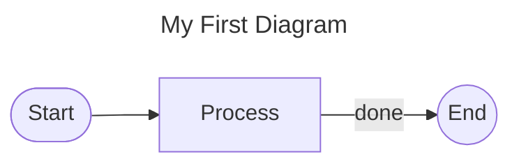

# go-mermaid

Pure Go library for generating and rendering [Mermaid](https://mermaid.js.org/) diagrams. No Node.js, no Chromium, no external processes.

## Installation

```sh
go get github.com/iokdigital/go-mermaid
```

Requires Go 1.20 or later. No CGo.

---

## High-Level Introduction

go-mermaid provides a programmatic Go API for building and rendering Mermaid diagrams. Instead of writing Mermaid source text manually, you construct diagram ASTs in Go and render them to any output format your application needs.

**Key design goals:**

- **Pure Go** — no external binaries, no Node.js, no browser automation
- **Multiple output formats** — SVG, PNG, PDF, HTML, JSON, DOT, Markdown, or raw Mermaid source
- **Type-safe diagram construction** — Go compiler catches missing fields and incorrect types
- **io.Writer everywhere** — write to files, HTTP responses, in-memory buffers, or any sink

**Diagram types supported:**

| Type | Mermaid keyword | SVG | PNG | PDF | JSON | DOT |
|------|-----------------|-----|-----|-----|------|-----|
| Flowchart | `flowchart` | ✅ | ✅ | ✅ | ✅ | ✅ |
| Sequence | `sequenceDiagram` | ✅ | ✅ | ✅ | ✅ | — |
| State | `stateDiagram-v2` | ✅ | ✅ | ✅ | ✅ | — |
| ER | `erDiagram` | ✅ | ✅ | ✅ | ✅ | — |
| Class | `classDiagram` | ✅ | ✅ | ✅ | ✅ | — |

---

## Quick Start

### 1. Build a diagram

```go
package main

import (
	"fmt"
	"os"

	diagram "github.com/iokdigital/go-mermaid"
	"github.com/iokdigital/go-mermaid/ast"
	"github.com/iokdigital/go-mermaid/render"
)

func main() {
	// Create a flowchart
	f := ast.NewFlowchart("My First Diagram", ast.DirectionLR)
	f.MustAddNode(&ast.FlowNode{ID: "A", Label: "Start", Shape: ast.ShapeRoundedRect})
	f.MustAddNode(&ast.FlowNode{ID: "B", Label: "Process", Shape: ast.ShapeRect})
	f.MustAddNode(&ast.FlowNode{ID: "C", Label: "End", Shape: ast.ShapeCircle})
	f.AddEdge(&ast.FlowEdge{From: "A", To: "B"})
	f.AddEdge(&ast.FlowEdge{From: "B", To: "C", Label: "done"})

	// Render it
	r := render.NewRenderer(diagram.NewRenderOptions())
	if err := r.RenderToFile("out.svg", f, diagram.FormatSVG); err != nil {
		fmt.Fprintln(os.Stderr, err)
		os.Exit(1)
	}
}
```

### 2. Render to any format

```go
r := render.NewRenderer(diagram.NewRenderOptions())

// To file
r.RenderToFile("out.png", f, diagram.FormatPNG)

// To HTTP response
w.Header().Set("Content-Type", r.ContentType(diagram.FormatSVG))
r.RenderTo(w, f, diagram.FormatSVG)

// To in-memory buffer
data, _ := r.RenderBytes(f, diagram.FormatMMD)
fmt.Println(string(data))
```

Output:



---

## Core Concepts

### Diagram types

Each diagram type has its own constructor and node/edge types:

```go
// Flowchart — directional graphs with nodes and edges
f := ast.NewFlowchart(title string, direction ast.Direction)

// Sequence — message exchanges between participants
s := ast.NewSequence(title string, autonumber bool)

// State — finite state machine
st := ast.NewState(title string)

// ER — entity-relationship model
e := ast.NewER(title string)

// Class — UML class diagram
c := ast.NewClass(title string)
```

### Renderer

The `render.DefaultRenderer` implements the `diagram.Renderer` interface:

```go
type Renderer interface {
    RenderTo(w io.Writer, d Diagram, format OutputFormat) error
    RenderBytes(d Diagram, format OutputFormat) ([]byte, error)
    RenderToFile(path string, d Diagram, format OutputFormat) error
    ContentType(format OutputFormat) string
    RenderMarkdown(d Diagram) string
}
```

Create one renderer and reuse it across requests:

```go
r := render.NewRenderer(diagram.NewRenderOptions())
```

### Output formats

```go
const (
    FormatMMD      OutputFormat = "mmd"      // Mermaid source
    FormatSVG      OutputFormat = "svg"      // SVG image
    FormatPNG      OutputFormat = "png"      // PNG image
    FormatHTML     OutputFormat = "html"      // Standalone HTML
    FormatPDF      OutputFormat = "pdf"      // PDF document
    FormatJSON     OutputFormat = "json"     // Diagram AST as JSON
    FormatDOT      OutputFormat = "dot"      // Graphviz DOT (flowchart only)
    FormatMarkdown OutputFormat = "md"       // Markdown with fenced code block
)
```

### Render options

```go
opts := diagram.NewRenderOptions()

// PNG resolution presets
opts.Resolution = diagram.ResolutionScreen  // 2× (default)
opts.Resolution = diagram.ResolutionPrint   // 300 DPI

// Custom SVG/PNG dimensions
opts.SVGPadding = 40
opts.SVGMaxWidth = 8000
opts.SVGMaxHeight = 6000

// Layout tuning (flowcharts only)
opts.Layout.NodeSpacingH = 60
opts.Layout.NodeSpacingV = 40
opts.Layout.RankSpacing = 80

// Air-gapped: use your own mermaid.js CDN
opts.CDNOverrideURL = "https://internal.cdn/mermaid.min.js"

r := render.NewRenderer(opts)
```

---

## Use Cases

### Generate API documentation diagrams

```go
// Document your API call flow
f := ast.NewFlowchart("User Authentication Flow", ast.DirectionTB)
f.MustAddNode(&ast.FlowNode{ID: "start", Label: "Login Page", Shape: ast.ShapeRoundedRect})
f.MustAddNode(&ast.FlowNode{ID: "creds", Label: "Enter Credentials", Shape: ast.ShapeRect})
f.MustAddNode(&ast.FlowNode{ID: "validate", Label: "Validate", Shape: ast.ShapeDiamond})
f.MustAddNode(&ast.FlowNode{ID: "success", Label: "Issue JWT", Shape: ast.ShapeRect})
f.MustAddNode(&ast.FlowNode{ID: "fail", Label: "Show Error", Shape: ast.ShapeRect})

f.AddEdge(&ast.FlowEdge{From: "start", To: "creds"})
f.AddEdge(&ast.FlowEdge{From: "creds", To: "validate"})
f.AddEdge(&ast.FlowEdge{From: "validate", To: "success", Label: "valid"})
f.AddEdge(&ast.FlowEdge{From: "validate", To: "fail", Label: "invalid"})
f.AddEdge(&ast.FlowEdge{From: "fail", To: "creds"})

r.RenderToFile("docs/auth-flow.svg", f, diagram.FormatSVG)
```

### Database schema visualization

```go
// Document your data model
e := ast.NewER("E-Commerce Schema")

e.AddEntity(ast.EREntity{
    Name: "users",
    Attributes: []ast.ERAttribute{
        {DataType: "uuid", Name: "id", Keys: []ast.ERKey{ast.KeyPrimary}},
        {DataType: "varchar", Name: "email"},
        {DataType: "timestamp", Name: "created_at"},
    },
})

e.AddEntity(ast.EREntity{
    Name: "orders",
    Attributes: []ast.ERAttribute{
        {DataType: "uuid", Name: "id", Keys: []ast.ERKey{ast.KeyPrimary}},
        {DataType: "uuid", Name: "user_id", Keys: []ast.ERKey{ast.KeyForeign}},
        {DataType: "decimal", Name: "total"},
    },
})

e.AddRelation(ast.ERRelation{
    From:        "users",
    To:          "orders",
    FromCard:    ast.CardOneMany,
    ToCard:      ast.CardZeroOne,
    Label:       "places",
    Identifying: true,
})

r.RenderToFile("schema.svg", e, diagram.FormatSVG)
```

### Service interaction logs

```go
// Document microservice communication
s := ast.NewSequence("Order Service Interaction", true)

s.AddParticipant(ast.Participant{Alias: "Client", Label: "Client App"})
s.AddParticipant(ast.Participant{Alias: "Order", Label: "Order Service"})
s.AddParticipant(ast.Participant{Alias: "Payment", Label: "Payment Service"})
s.AddParticipant(ast.Participant{Alias: "Inventory", Label: "Inventory Service"})

s.AddMessage(ast.SeqMessage{
    From: "Client", To: "Order", Text: "POST /orders", Style: ast.MsgSync,
})
s.AddMessage(ast.SeqMessage{
    From: "Order", To: "Payment", Text: "charge()", Style: ast.MsgSync, Activate: true,
})
s.AddMessage(ast.SeqMessage{
    From: "Payment", To: "Order", Text: "payment_id", Style: ast.MsgAsync,
})
s.AddMessage(ast.SeqMessage{
    From: "Order", To: "Inventory", Text: "reserve()", Style: ast.MsgSync, Activate: true,
})

r.RenderToFile("sequence.svg", s, diagram.FormatSVG)
```

### HTTP response with embedded diagram

```go
func diagramHandler(w http.ResponseWriter, r *http.Request) {
    f := buildServiceMap()
    
    w.Header().Set("Content-Type", "image/svg+xml")
    r := render.NewRenderer(diagram.NewRenderOptions())
    if err := r.RenderTo(w, f, diagram.FormatSVG); err != nil {
        http.Error(w, err.Error(), 500)
    }
}
```

### Embed diagram in Markdown documentation

```go
f := buildFlowchart()
r := render.NewRenderer(diagram.NewRenderOptions())

md := r.RenderMarkdown(f)
// md = "```mermaid\nflowchart LR\n...\n```\n"

// Write to README or docs
os.WriteFile("README.md", []byte(md), 0644)
```

### JSON export for tooling

```go
// Export diagram structure for code generation or analysis
data, _ := r.RenderBytes(d, diagram.FormatJSON)
os.WriteFile("diagram.json", data, 0644)
```

---

## Error Handling

```go
r := render.NewRenderer(opts)

// Standard errors
_, err := r.RenderBytes(d, "invalid-format")
// → ErrInvalidFormat

// Fallback format — some diagram/format combinations aren't yet implemented
_, err := r.RenderBytes(d, diagram.FormatPNG)  // e.g., sequence diagram PNG
var ferr *diagram.FallbackFormatError
if errors.As(err, &ferr) {
    // Fall back to HTML
    data, _ = r.RenderBytes(d, ferr.FallbackFormat())
}

// Duplicate node IDs
_, err := f.AddNode(&ast.FlowNode{ID: "A"})
// ... later ...
_, err = f.AddNode(&ast.FlowNode{ID: "A"})
// → ErrDuplicateNodeID
```

---

## Node Shapes Reference

```go
ShapeRect          // A[label]         — rectangle
ShapeDiamond       // A{label}         — decision diamond
ShapeCircle        // A((label))       — circle
ShapeRoundedRect   // A(label)         — stadium/pill
ShapeParallelogram // A[/label/]       — parallelogram
ShapeHexagon       // A{{label}}       — hexagon
ShapeStadium       // A([label])       — stadium shape
ShapeAsymmetric    // A>label]         — asymmetric
```

## Edge Styles Reference

```go
EdgeSolid     // -->    — solid arrow
EdgeDotted    // -.->   — dotted arrow
EdgeThick     // ==>    — thick arrow
EdgeInvisible // ~~~    — invisible link
EdgeNoArrow   // ---    — line without arrow
```

---

## Package Structure

```
go-mermaid/
├── diagram.go      # DiagramType, OutputFormat, Renderer interface, errors
├── options.go      # RenderOptions, Resolution presets
├── render/
│   └── renderer.go   # DefaultRenderer — use this
├── ast/
│   ├── flowchart.go  # FlowchartDiagram, FlowNode, FlowEdge
│   ├── sequence.go   # SequenceDiagram, Participant, SeqMessage
│   ├── state.go      # StateDiagram, DiagramState, StateTransition
│   ├── er.go         # ERDiagram, EREntity, ERRelation
│   └── class.go      # ClassDiagram, DiagramClass, ClassRelation
├── mmd/    # → Mermaid source text
├── svg/    # → SVG image
├── png/    # → PNG image (via SVG rasterizer)
├── pdf/    # → PDF document
├── html/   # → Standalone HTML (mermaid.js CDN)
├── json/   # → Diagram AST as JSON
└── dot/    # → Graphviz DOT (flowchart only)
```

**You only need to import:**

```go
import (
    diagram "github.com/iokdigital/go-mermaid"  // types and renderer interface
    "github.com/iokdigital/go-mermaid/ast"     // diagram builders
    "github.com/iokdigital/go-mermaid/render"  // DefaultRenderer
)
```

All format sub-packages (`mmd`, `svg`, `png`, etc.) are imported by `render` and should not be imported directly in application code.

---

## FAQ

**Q: Why not just generate Mermaid text?**

Building diagrams programmatically in Go gives you type safety, compile-time checking, and the ability to derive diagram content from your domain models (database schemas, API specs, etc.).

**Q: Does this require an internet connection?**

Only for HTML output using the default mermaid.js CDN. For air-gapped environments, set `RenderOptions.CDNOverrideURL` to your internal CDN. SVG, PNG, and PDF are fully offline.

**Q: Can I customize the diagram appearance?**

SVG output uses a fixed style sheet optimized for clarity. Layout tuning (node spacing, rank spacing) is available via `RenderOptions.Layout`. Full theme customization is on the roadmap.

**Q: What Go versions are supported?**

Go 1.20 and later. Tested on Go 1.23 and 1.24 in CI.